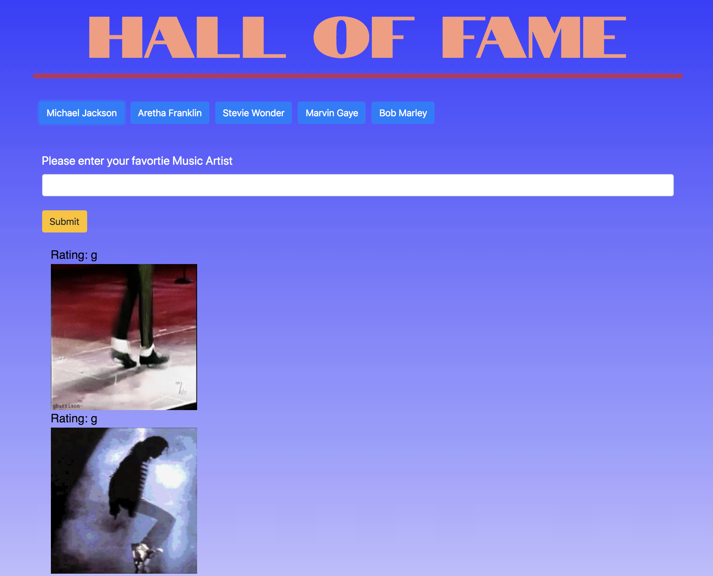

# GifTastic (Ajax Assignment)

### **Overview**

In this assignment, I created a simple form where the user can access their favorite Giphy's. Using JavaScript for the core of the site and dynamic buttons and jQuery to manipulate the HTML. Topped off with some Bootstrap and CSS to make a stylish and effective webpage.
 - - -
### **Interacting with the Site**

When the user arrives to the page, they are given 5 preliminary buttons to access the appropriate artists of each button. They may then input the name of one of their favorite artists and press submit to see the according Giphy's and the rating. They can continue to add artists until their desired list is complete. Site Twist: The Giphs appear static but can be animated by clicking the image!




This Game was created with:
```
HTML
CSS
JavaScript
jQuery
Giphy-API
Bootstrap
```

[Click Here to enter the Hall of Fame!](https://ticola.github.io/GifTastic/)